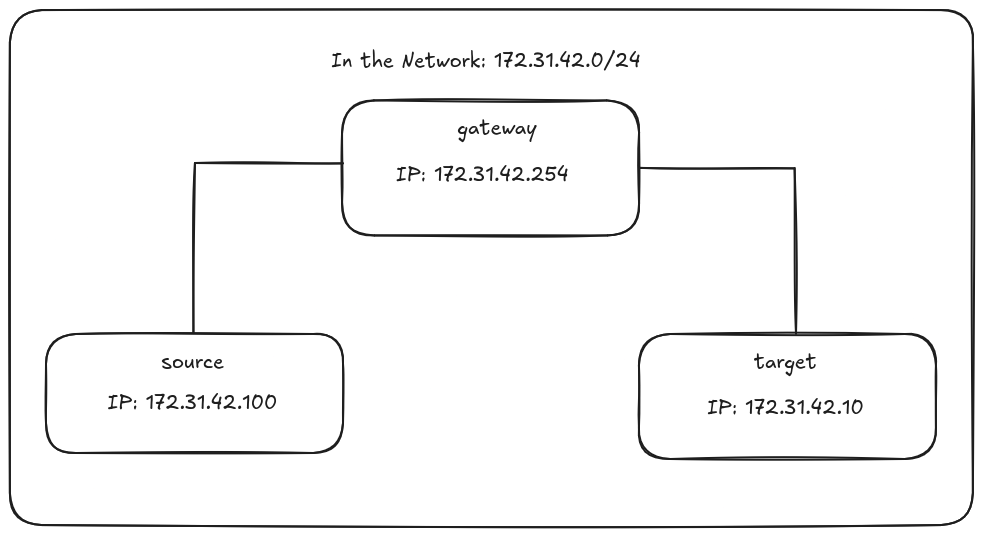

# ft_malcolm Docker Environment

## Overview

This Docker environment reproduces a local network to test and understand Man-in-the-Middle (MITM) attacks via ARP poisoning. It uses a **3 virtual machines** architecture that simulates an attack scenario.

## Network Architecture

### Network Topology



### Machine Roles

#### SOURCE (172.31.42.100) - The attacking machine

- **Function**: Executes the ft_malcolm program to intercept network traffic
- **Objective**: Position itself as an intermediary between TARGET and GATEWAY

#### GATEWAY (172.31.42.254) - The legitimate router

- **Function**: Internet gateway for the local network
- **Criticality**: Main target of ARP poisoning

#### TARGET (172.31.42.10) - The victim machine

- **Function**: Normal network user generating traffic
- **Impact**: All its traffic can be intercepted without its knowledge

## Environment Startup

### Automatic Launch

The `restart.sh` script completely manages the environment lifecycle:

```bash
cd Docker/
./restart.sh
```

**Automated actions:**

- Complete cleanup of existing Docker environment
- Rebuild images with latest modifications
- Coordinated startup of the 3 virtual machines
- Network state verification

### Automatic Parameter Configuration

Once the environment is started, use the `get_params.sh` script to obtain network parameters:

```bash
docker exec -it source bash
./get_params.sh
```

This script automates network discovery and generates appropriate ft_malcolm commands with the correct MAC and IP addresses.

### Attack Verification

To observe the effectiveness of the MITM attack, monitor changes in the TARGET machine's ARP table:

- **Before attack**: TARGET associates GATEWAY's IP with its real MAC address
- **During attack**: TARGET associates GATEWAY's IP with SOURCE's MAC address

## Network Configuration

### IP Addressing

- **Isolated network**: 172.31.42.0/24
- **Docker gateway**: 172.31.42.1 (infrastructure)
- **Simulated gateway**: 172.31.42.254 (spoofing target)
- **Attacking machine**: 172.31.42.100
- **Victim machine**: 172.31.42.10
