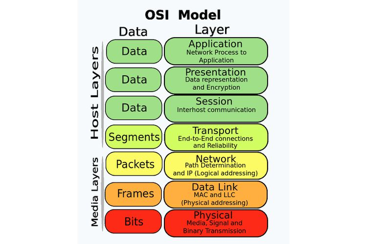
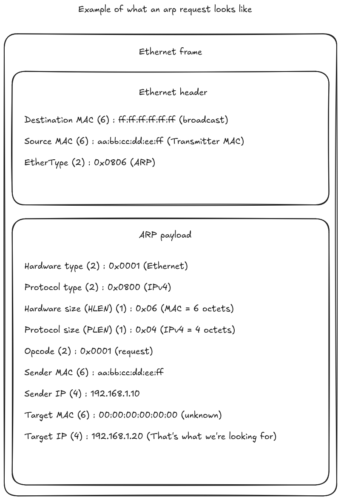

# ft_malcolm

This 42 project aims to introduce Man-in-the-Middle (MITM) attacks.
To achieve this, I've identified several fundamental concepts to understand:

- The [OSI model](https://en.wikipedia.org/wiki/OSI_model), particularly layer 2 (data link) where the mapping between MAC and IP addresses occurs.

- The ARP protocol, which allows a machine to discover the MAC address associated with a given IP address in a local network.

- The ARP table, internal memory maintaining these associations, which can be corrupted by an attack called ARP spoofing/poisoning.

Although old, the ARP protocol is still widely used and remains vulnerable, making this type of attack still relevant to understand.

## What is a MITM attack?

A **Man-in-the-Middle (MITM)** attack is a technique where an attacker positions themselves between two communicating parties to intercept, analyze, or modify their exchanges.

🎥 **Detailed explanation**: [https://www.youtube.com/watch?v=A7nih6SANYs]

## The ARP protocol

The ARP protocol (Address Resolution Protocol) maps IP addresses to MAC addresses on a local network.

### Ethernet frame composition

Before analyzing ARP, we need to understand the Ethernet frame that encapsulates it:

- **Destination MAC**: Destination MAC address (6 bytes)
- **Source MAC**: Source MAC address (6 bytes)  
- **EtherType**: Type of protocol carried (2 bytes, ARP = 0x0806)
- **Payload**: Useful data (ARP packet)
- **FCS**: Frame Check Sequence for error detection (4 bytes) (not relevant here)

### ARP request composition

An ARP request contains:

- **Hardware Type**: Hardware type (Ethernet = 1)
- **Protocol Type**: Protocol type (IPv4 = 0x0800)
- **Hardware Length**: MAC address size (6 bytes)
- **Protocol Length**: IP address size (4 bytes)
- **Operation**: Operation type (Request = 1, Reply = 2)
- **Sender MAC**: Sender's MAC address
- **Sender IP**: Sender's IP address
- **Target MAC**: Target's MAC address
- **Target IP**: Target's IP address

### Diagram of an ARP request encapsulated in an Ethernet frame

## Installation/Usage

For launching the executable and the Docker test environment, refer to the **[Docker folder README](Docker/README.md)** which contains all detailed instructions.
